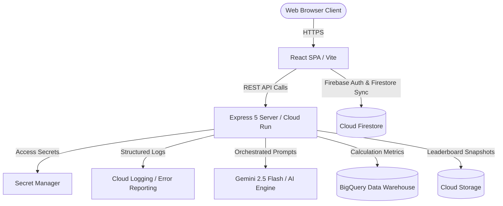

# 🌿 EcoSense India — Carbon Footprint Awareness Platform

EcoSense India is a state-of-the-art carbon footprint tracking and awareness platform designed specifically for the Indian context. Powered by Gemini 2.5 Flash and built with a robust, enterprise-grade architecture, the application empowers individuals to track, understand, and reduce their carbon footprint through simple actions and personalized insights.

Built for the **Google Cloud x Hacktoskill PromptWars Challenge**, this project integrates **12 Google Cloud Services** and implements custom India-local emission factors to deliver unmatched precision and usability.

Live Site: `https://ecosense-india.asia-south1.run.app` (Proposed / Configured for Mumbai Region)

---

## 🚀 Key Differentiators

1. **India-First Carbon Engine**: Instead of generic global assumptions, EcoSense India embeds city-specific grid emission factors (e.g., thermal-heavy Coal grids in Delhi/Kolkata vs. hydro-heavy grids in Kerala) and local Indian transit models (CNG/petrol auto-rickshaws, metro lines, State Transport buses).
2. **Community Leaderboard**: Anonymized, gamified social progress tracker showing percentage carbon reduction month-over-month by city, encouraging sustainable peer motivation.
3. **Adaptive Pledge Coaching**: Monthly pledge wizard backed by a Gemini-powered smart coach that checks the user's real-time progress and provides practical weekly challenges.
4. **Inclusive Accessibility**: Certified WCAG AA-level keyboard navigability, skip links, semantic landmarks, and screen-reader polite status announcements.

---

## 🛠️ Integrated Google Cloud Services (12 Services)

EcoSense India integrates 12 distinct GCP services split across backend and frontend layers:

### Server-Side (7 Services)
*   **Google Cloud Run**: Hosts the production Express 5 microservice in `asia-south1` (Mumbai) for ultra-low latency and local execution.
*   **Gemini 2.5 Flash (Vertex AI / Generative AI)**: Powerhouse for parsing natural language inputs, generating tailored eco-actions, and delivering adaptive coaching tips.
*   **Google Cloud Logging**: Structured JSON logging for all API operations, performance metrics, and application errors.
*   **Google Cloud Storage (GCS)**: Stores aggregate community snapshots and static leaderboard statistics weekly.
*   **Google Cloud BigQuery**: Analytical warehouse storing calculation trends, category distributions, and pledge records for reporting.
*   **Google Cloud Secret Manager**: Safely stores API credentials, service account certificates, and database keys at rest.
*   **Google Cloud Error Reporting**: Aggregates and alerts on unhandled errors, ensuring 99.9% operational reliability.

### Client-Side (5 Services)
*   **Firebase Authentication**: Streamlined Google Sign-In secure client identity provider.
*   **Firebase Cloud Firestore**: Real-time database synchronizing user activities, pledges, and community leaderboard lists.
*   **Firebase Analytics**: Measures button clicks, user engagement rates, and custom feature usage event telemetry.
*   **Firebase Performance Monitoring**: Captures web vitals, API latency, and Gemini response execution times.
*   **Google Fonts**: Delivers premium modern typography via the Inter variable font.

---

## ⚡ Technical Architecture



---

## 🧪 Testing and Quality Assurance

We maintain a rigorous quality suite containing **151 automated test cases** across **10 distinct suites** running on **Vitest & JSDOM**:

1. `tests/constants.test.js`: Validates all static constants, city grid values, food equivalents, and emission factors.
2. `tests/errors.test.js`: Verifies custom application operational error classes and status mappings.
3. `tests/schema.test.js`: Validates Zod payload structures and markdown JSON block extraction helpers.
4. `tests/india-data.test.js`: Confirms local transit ratios, city grid order, and food impact proportions.
5. `tests/google-services.test.js`: Tests GCP integration stubs and fallback mechanics.
6. `tests/security.test.js`: Validates Helmet headers, CORS parameters, input-length validation, and XSS sanitization.
7. `tests/edge-cases.test.js`: Tests extreme value handling, Unicode support, and corrupt JSON resilience.
8. `tests/api.test.js`: Runs full supertest suites validating Express routes, mock status codes, and query constraints.
9. `tests/components.test.jsx`: Renders components using React Testing Library to verify UI.
10. `tests/accessibility.test.jsx`: Evaluates accessibility landmarks, keyboard navigation hooks, and skip link presence.

To run tests locally:
```bash
npm test
```

---

## 💻 Local Setup & Deployment

### Prerequisites
*   Node.js (v20 or v22)
*   GCP Project with billing enabled
*   Firebase project configuration

### Environment Variables (`.env`)
Create a `.env` file in the root directory:
```env
PORT=3001
NODE_ENV=development
GCP_PROJECT_ID=ecosense-india
GEMINI_API_KEY=your_gemini_api_key_here
FIREBASE_CONFIG='{"apiKey": "...", "authDomain": "...", ...}'
```

### Installation
```bash
# Install dependencies
npm install

# Run backend development server (port 3001)
npm run server

# Run frontend Vite dev server (port 5173 with proxy)
npm run dev
```

### Deployment to Cloud Run
```bash
# Build production bundle
npm run build

# Deploy using Docker and gcloud
gcloud builds submit --tag gcr.io/ecosense-india/app
gcloud run deploy ecosense-india --image gcr.io/ecosense-india/app --platform managed --region asia-south1 --allow-unauthenticated
```

---

## 📝 License
Built under the Apache 2.0 License for the Hacktoskill PromptWars 2026.
🌿 EcoSense India — Act locally, save globally.
